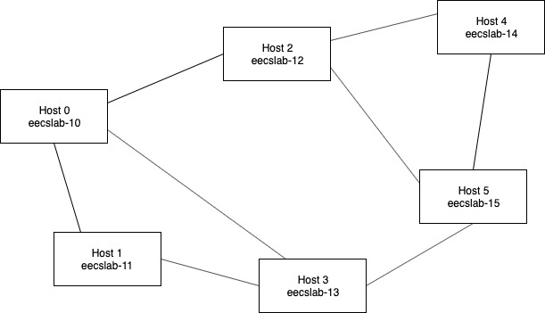

# p2p_network
An application to create a simple peer to peer network for transferring files between different hosts. Implemented in Java using the standard Java socket programming API. The application was tested using a set of six hosts in Case Western Reserve University's EECS lab servers.

## Build and Run Instructions
Perform the following steps to build and launch the p2p client on *each host (computer)* that you want to be part of the peer to peer network. 
1. Create configuration files in base directory. They are described in the following section.
2. Create new directories `shared` and `obtained` if they do not exist already. `shared` will contain all the files that this peer (host) can share with other peers in the p2p network. `obtained` will contain the files that this peer successfully requests from other peers in the network.
3. Compile the code. `javac p2p.java`.
4. Deploy the p2p client. `java p2p`.

## Config Files
Make sure all specified ports in configuration files are open for TCP connections. 
### `config_peer.txt`
* First line is the host running this instance of the p2p client. e.g. `eecslab-10.case.edu` This is so that the p2p client application can get the IP address of the host it is running on.
* Second line is the welcoming port for neighboring peer TCP connections.
* Third line is the welcoming port for file transfer TCP connections.
### `config_neighbors.txt`
* Each line follows the format `neighbor_IP port_no`, where `neighbor_IP` is the IP address of one of this peer's neighbors, and `port_no` is the welcoming port number corresponding with that neighbor peer.
* There is one line for each of the peer's neighbors.
### `config_sharing.txt`
* Each line is the file name of a file that exists in the `p2p/shared` directory.
* This is the list of files that this peer can share with other peers in the p2p network.

## Network Topology
The p2p network topology is determined by each individual host's set of neighbor peers, which is specified in each host's configuration file. The network topology is not fixed. See file `topology.jpg` for an example of one of the p2p network topologies used to test the code. 

## Implementation Specifics
### Query IDs
* Each peer is allocated a range of 100,000,000 possible query ids, mutually exclusive from the other peers.
* Queryhit ids match their corresponding query ids. So if a query for book A was sent with id = 1, then the queryhit for book A will have id = 1, too.
* The query id for each peer starts indexing at the value equal to `query_base = least significant digit of peer IP * 100,000,000`.
  * For example, since eecslab-10 is on 129.22.23.202, that peer is allowed to use query ids 200,000,000 to 299,999,999.
* This ensures unique query ids as long as a single peer does not put more than 100,000,000 queries into the network before any of those queries results in a hit or is dropped.

### Query Flooding / Relaying
* Each peer has a table (HashMap) called `received`, which maps the ids of all the queries this peer has received to the time in milliseconds when it received it. **This allows each peer to check for duplicate queries and not relay queries it has already relayed**. 
  * If a peer received a query whose id is already in the `received` table (and the time associated with receiving that query was in the last 3 seconds), then the peer knows it has already relayed this query forward and will drop the query.
  * If a peer received a query whose id is not already in the `received` table *or* the id in the table was receive more than 3 seconds ago, then the peer knows this is a new query and will relay it to its neighbors. It will also insert a new entry into the `received` table indicating that this new query id has been received or update the received time.
* Each peer also has a table (HashMap) called `sent`, which maps the ids of all queries this peer has sent or relayed forward to the IP address of the peer that this peer received the query from. This will allow for a queryhit to retrace the path back to the peer that originally sent the query. If the peer is sending an original "new" query, then the IP address field in the `sent` table will be `null`. 
* Once a peer verifies a received query is new, it sends the query to all of its neighboring peers except for the peer that it read the query from.
  * Inserts a new entry into the table `sent`, mapping the query id to the IP address of the peer that this peer receieved the query from.
  * Loops through the list of connected neighbor sockets and writes the query message to each socket.
* The functionality described here is primarily performed in the NeighborThreads.
* Note there is no alteration of the query message, adhering to protocol.

### Query Hits
* The `sent` table described above maps all relayed or sent query ids to the IP address of the peer that this peer read the query from.
* If the peer receives a queryhit message, it looks up the queryhit id in its `sent` table and gets the corresponding IP address. This is the "immediate neighbor" that sent the query.
* The peer writes the queryhit message to the socket connected to the "immediate neighbor."
* Duplicate queryhits from multiple peers that own the requested file are handled so that one file request from a peer does not result in multiple file transfers:
  * When a peer receives a queryhit message, it will check in the `received` table whether or not this peer has already received the a queryhit message with the same id.
    * If the `received` table already contains this queryhit id (received within the last 3 seconds), then it will drop the queryhit message and won't let it retrace back.
    * If the `received` table does not contain this queryhit id, then it will "act normally" and relay the queryhit to the "immediate neighbor" that sent the query.
      * It also inserts a new entry into the `received` table indicating that this queryhit id was already received and processed by the peer so that subsequent queryhits for the same thing are dropped.
  * The `received` table makes a distinction between received ids for queries and received ids for queryhits so that they are not mixed up. 
* The functionality described here is primarily performed in the NeighborThreads.
* Note there is no alteration of the queryhit message, adhering to protocol.

### Hearbeat Messages
* Heartbeat messages are sent every 30 seconds by the HeartbeatThreads responsible for each of the peer's neighbors.
* When a NeighborThread has not received a heartbeat message for its neighbor in 75 seconds, it closes the socket to this neighbor peer and removes the connection socket from the list of sockets.

### Goodbye Messages
* Goodbye messages are identified by the header `"G:"`.
* They are sent to all of a peer's neighbors if the peer chooses to "Leave."
* Upon receiving a goodbye message, the peer closes the socket to the peer that sent the goodbye message and removes that socket from the list of sockets.
* Listening for goodbye messages is performed by the NeighborThreads.

## Command Implementation
### Connect
* Reads `config_neighbors.txt` to get a list of neighbor IP addresses and welcome ports.
* For each neighbor in the config file:
  * Does nothing if the connection to this neighbor already exists. This ensures there is only *one* TCP connection between any two peer neighbors.
  * If the connection does not yet exist, starts a ClientConnectThread to setup the TCP connection.
  * The ClientConnectThread handles adds the newly created socket connected to neighbor to list of existing sockets for the peer.

### Get
* Generates a unique query ID for the new query.
* Puts the query ID into table of received queries to prevent "cycles" where the host forwards a query that it originally sent.
* Writes the query message to each connected neighboring peer by looping through the list of sockets.

### Leave
* For each socket in the list of sockets to neighboring peers:
  * Writes a goodbye message into the socket, which tells neighbor peer to close the socket on his side.
  * Closes the socket on this peer's side.
* Clears the list of sockets and list of connected neighbor IP addresses.

### Exit
Does the same thing as the `Leave` command, but also breaks out of the main program loop in `p2p` and terminates peers, which terminates the peer.

## Main Program and Threads

The "main" program in class `p2p` does the following things:
  * Starts the welcome threads.
  * Listens for user input and calls the appropriate methods.

The threads in the program do the following things:
* WelcomeThread
  * Listens for a peer neighbor connection over a welcome socket.
  * Starts a new thread (NeighborThread) to handle peer neighbor communications once a connection is accepted and adds that socket to a list of existing sockets.
* WelcomeTransferThread
  * Listens for an ad-hoc peer connection for file transfer requests over a welcome socket.
  * Starts a new thread (TransferServerThread) to handle sending the file to peer once a connection is accepted.
* ClientConnectThread
  * Initiates contact with one neighboring peer in order to establish a socket for neighbor peer communications.
  * Adds the socket to a list of existing sockets for the peer.
  * Starts a new thread (NeighborThread) to handle peer neighbor communications.
* NeighborThread
  * Starts a new HeartbeatThread upon creation.
  * Listens for query, queryhit, and heartbeat messages from one specific neighboring peer.
  * Disconnects from the neighbor and closes socket upon query timeout.
  * Disconnects from the neighbor and closes socket upon a goodbye message.
  * Relays received queries to *all* neighbor peers
  * If received a query for which this peer has the file, drops the query and sends a queryhit message to its neighbor. 
  * Relays received queryhits to the neighbor on the reverse path.
  * If received a queryhit for the file *this* peer has requested, drops the queryhit and creates a new transferClientThread to initiate ad-hoc TCP file request.
* HeartbeatThread
  * Periodically sends heartbeat messages to one specific neighboring peer.
  * Terminates when the neighboring peer is dead.
* TransferServerThread
  * Writes the requested file into the socket so that the other peer can receive the file.
* TransferClientThread
  * Initiates contact with a peer that it knows has the desired file and creates the socket.
  * Writes the file request to that socket.
  * Reads the file from the socket and writes the file to the `/obtained` folder.
